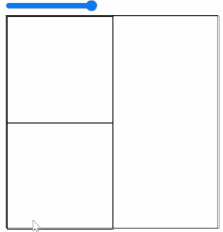
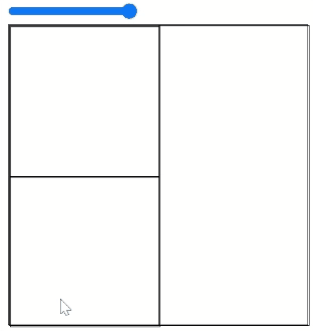

# co-flex

[](https://github.com/cocoss-org/co-flex/actions)&nbsp;
[](https://npmjs.com/package/co-flex)&nbsp;
[](https://github.com/cocoss-org/co-flex/blob/master/LICENSE)&nbsp;
[](https://twitter.com/BelaBohlender)

React wrapper for [yoga](https://github.com/facebook/yoga).

_use flexbox inside react_


[_Example: Nested layout animation_](https://cocoss-org.github.io/co-flex/three-spring-virtualized)

Use it with [react-three-fiber](https://github.com/pmndrs/react-three-fiber), react-dom, or whatever works with react.

# Functionality

```typescript
//provide the parent node
<FlexNodeContextProvider />

//create a yoga node
useYogaNode()

//create a root yoga node
useYogaRootNode()
```

# Examples

## [verbose](https://cocoss-org.github.io/co-flex/verbose)


## [dom](https://cocoss-org.github.io/co-flex/dom)



## [react-spring](https://cocoss-org.github.io/co-flex/dom-spring)



## [co-virtualize](https://cocoss-org.github.io/co-flex/dom-spring-virtualized)


## [three](https://cocoss-org.github.io/co-flex/three-spring-virtualized)


